# 🖼️ Bilder-Verzeichnis & Asset-Katalog

Automatisch generierte Übersicht aller verfügbaren Bild-Assets im Ordner `images/`.

---

## 1. Übersicht aller Fotos & Verwendung

| Miniatur | Dateiname | Kategorie | Grösse | Dimension | Datum | Status |
|---|---|---|---|---|---|---|
| 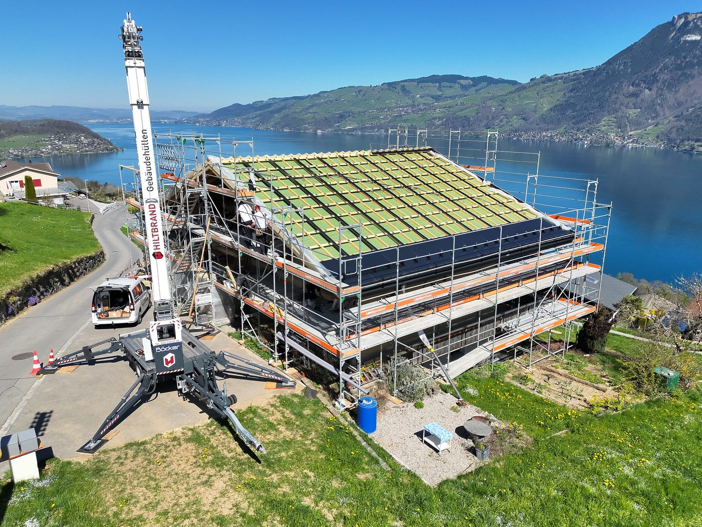 | `benefits_drohne.jpg` | Baustelle & Benefit | 482.5 KB | 1400x1050 | 28.09.2026 17:35 | ⚪ Frei verfügbar |
|  | `danke.png` | Baustelle & Benefit | 1490.5 KB | 1456x816 | 28.09.2026 17:35 | ⚪ Frei verfügbar |
|  | `hero.jpg` | Hero & Header | 160.7 KB | 1400x933 | 28.09.2026 17:35 | 🟢 Im Einsatz in `Hiltbrand_Dachdecker.html` |
|  | `logo.png` | Logo & Icon | 8.2 KB | 260x150 | 28.09.2026 17:35 | 🟢 Im Einsatz in `Hiltbrand_Dachdecker.html` |
| 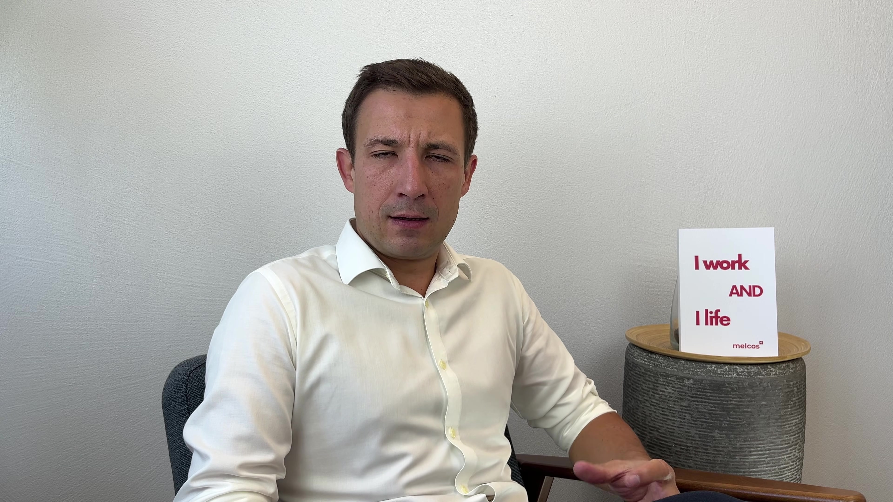 | `melcos_keyframe_2.jpg` | Baustelle & Benefit | 1055.4 KB | 3840x2160 | 03.10.2026 18:01 | ⚪ Frei verfügbar |
| 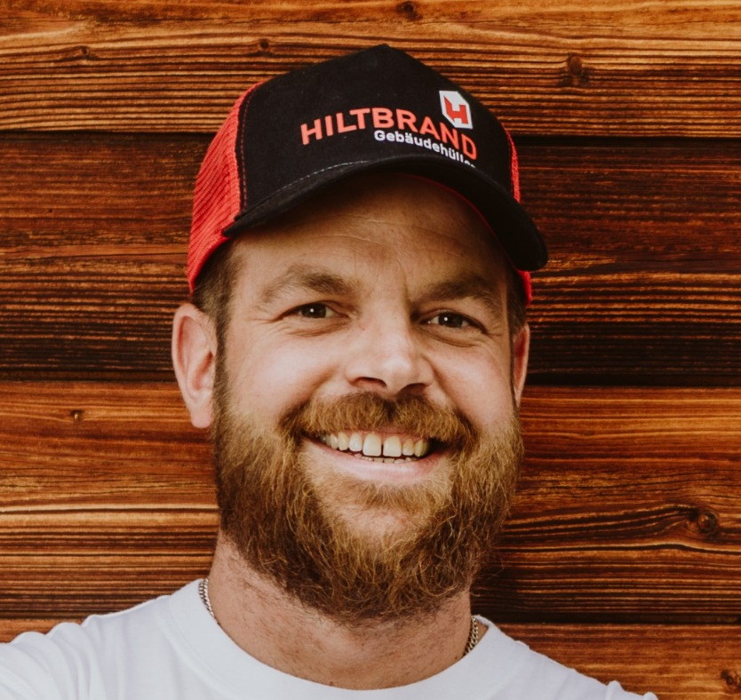 | `michael.jpg` | Team & Porträt | 186.7 KB | 834x788 | 28.09.2026 17:35 | 🟢 Im Einsatz in `Hiltbrand_Dachdecker.html` |
| 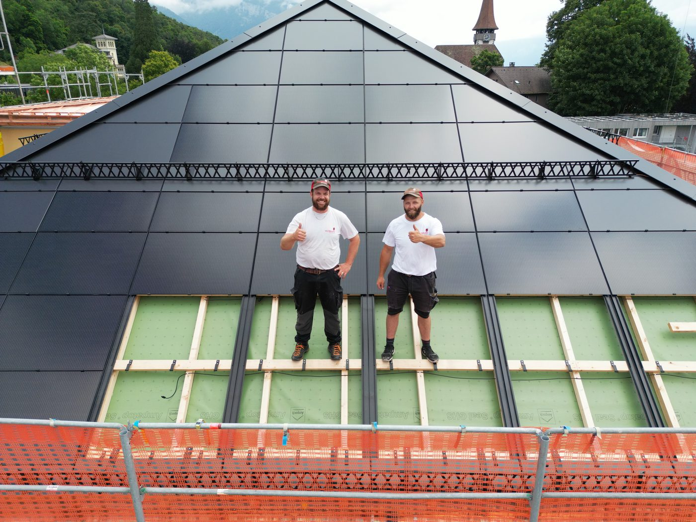 | `q1_benefit.jpg` | Baustelle & Benefit | 295.8 KB | 1400x1050 | 28.09.2026 17:35 | 🟢 Im Einsatz in `zurbuchen_Holzbauer.html` |
| 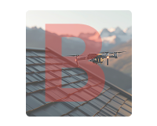 | `q1_bewaehrtes_handwerk.png` | Baustelle & Benefit | 37.6 KB | 200x160 | 28.09.2026 17:35 | ⚪ Frei verfügbar |
| 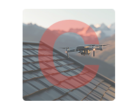 | `q1_effiziente_maschinen.png` | Baustelle & Benefit | 38.0 KB | 200x160 | 28.09.2026 17:35 | ⚪ Frei verfügbar |
| 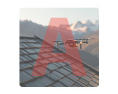 | `q1_moderne_technik.png` | Baustelle & Benefit | 37.8 KB | 200x160 | 28.09.2026 17:35 | ⚪ Frei verfügbar |
| 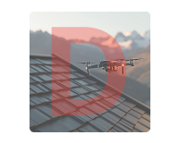 | `q1_sicherer_arbeitgeber.png` | Baustelle & Benefit | 37.8 KB | 200x160 | 28.09.2026 17:35 | ⚪ Frei verfügbar |
| 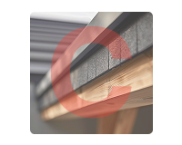 | `q2_baustellen.png` | Baustelle & Benefit | 39.3 KB | 200x160 | 28.09.2026 17:35 | ⚪ Frei verfügbar |
| 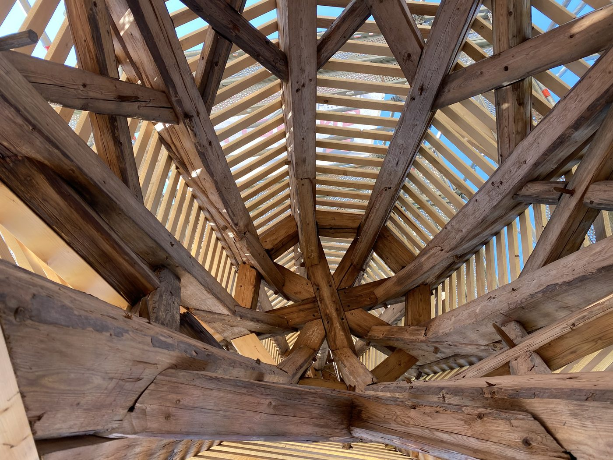 | `q2_benefit.jpg` | Baustelle & Benefit | 325.7 KB | 1400x1050 | 28.09.2026 17:35 | ⚪ Frei verfügbar |
| 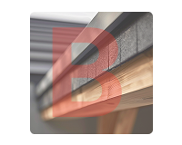 | `q2_details.png` | Baustelle & Benefit | 38.5 KB | 200x160 | 28.09.2026 17:35 | ⚪ Frei verfügbar |
| 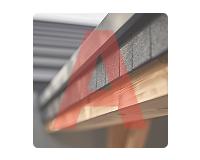 | `q2_ganzheitlich.png` | Baustelle & Benefit | 38.8 KB | 200x160 | 28.09.2026 17:35 | ⚪ Frei verfügbar |
| 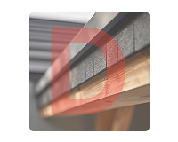 | `q2_kundenkontakt.png` | Baustelle & Benefit | 38.6 KB | 200x160 | 28.09.2026 17:35 | ⚪ Frei verfügbar |
|  | `q3_ansagen.png` | Baustelle & Benefit | 47.1 KB | 200x160 | 28.09.2026 17:35 | ⚪ Frei verfügbar |
|  | `q3_benefit.png` | Baustelle & Benefit | 1296.6 KB | 1456x816 | 28.09.2026 17:35 | ⚪ Frei verfügbar |
|  | `q3_ehrgeiz.png` | Baustelle & Benefit | 47.7 KB | 200x160 | 28.09.2026 17:35 | ⚪ Frei verfügbar |
|  | `q3_freiraum.png` | Baustelle & Benefit | 47.2 KB | 200x160 | 28.09.2026 17:35 | ⚪ Frei verfügbar |
|  | `q3_kameradschaft.png` | Baustelle & Benefit | 47.2 KB | 200x160 | 28.09.2026 17:35 | ⚪ Frei verfügbar |
| 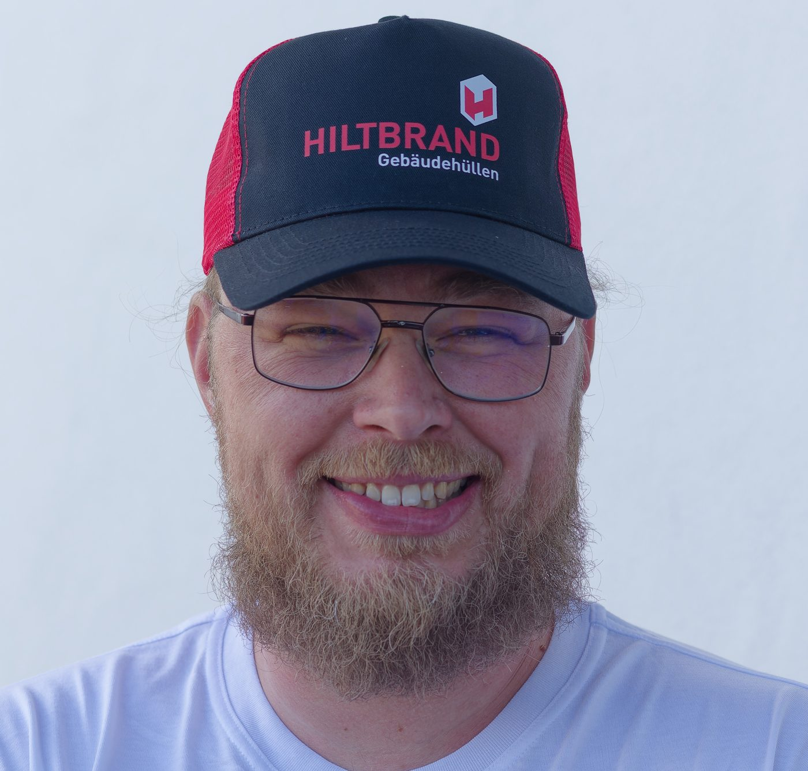 | `stefan.jpg` | Team & Porträt | 204.2 KB | 1400x1337 | 28.09.2026 17:35 | 🟢 Im Einsatz in `Hiltbrand_Dachdecker.html` |
| 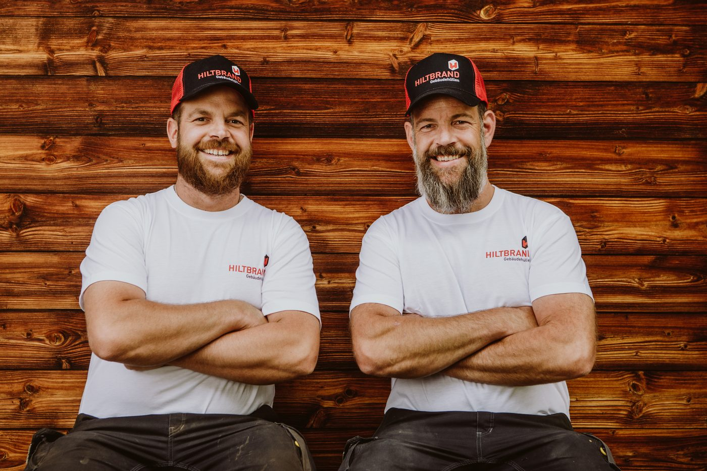 | `team_alt.jpg` | Team & Porträt | 259.8 KB | 1400x933 | 28.09.2026 17:35 | ⚪ Frei verfügbar |
| 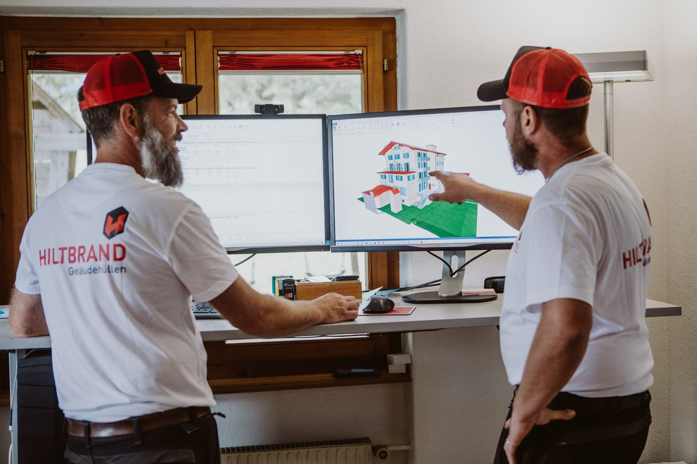 | `vorstellung.jpg` | Baustelle & Benefit | 160.7 KB | 1400x933 | 28.09.2026 17:35 | ⚪ Frei verfügbar |
| 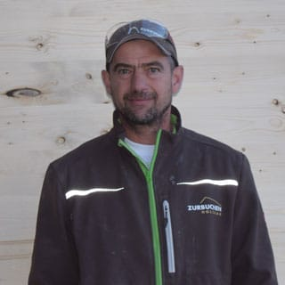 | `alain.jpg` | Team & Porträt | 10.5 KB | 320x320 | 28.09.2026 19:08 | 🟢 Im Einsatz in `zurbuchen_Holzbauer.html` |
| 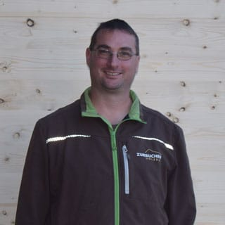 | `beat.jpg` | Team & Porträt | 10.2 KB | 320x320 | 28.09.2026 19:08 | 🟢 Im Einsatz in `zurbuchen_Holzbauer.html` |
| 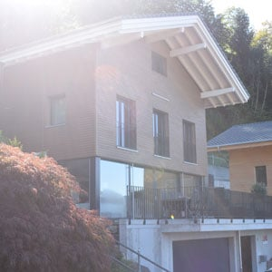 | `cta_bg.jpg` | Baustelle & Benefit | 14.5 KB | 300x300 | 28.09.2026 19:08 | ⚪ Frei verfügbar |
| 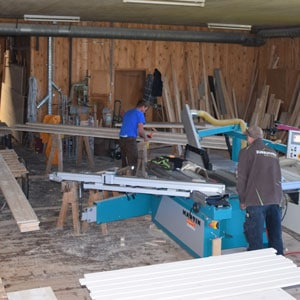 | `hero.jpg` | Hero & Header | 23.8 KB | 300x300 | 28.09.2026 19:08 | ⚪ Frei verfügbar |
| 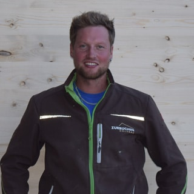 | `jonas.jpg` | Team & Porträt | 16.4 KB | 320x320 | 28.09.2026 19:08 | 🟢 Im Einsatz in `zurbuchen_Holzbauer.html` |
| 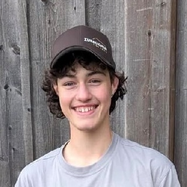 | `levin.jpg` | Team & Porträt | 36.1 KB | 320x320 | 28.09.2026 19:08 | 🟢 Im Einsatz in `zurbuchen_Holzbauer.html` |
|  | `logo-negativ.png` | Logo & Icon | 3.7 KB | 240x113 | 28.09.2026 19:08 | 🟢 Im Einsatz in `zurbuchen_Holzbauer.html` |
|  | `logo.png` | Logo & Icon | 4.1 KB | 240x113 | 28.09.2026 19:08 | 🟢 Im Einsatz in `zurbuchen_Holzbauer.html` |
| 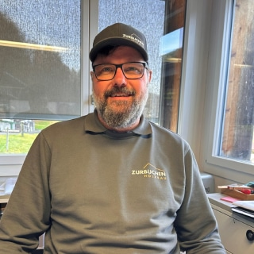 | `markus.jpg` | Team & Porträt | 37.4 KB | 320x320 | 28.09.2026 19:08 | 🟢 Im Einsatz in `zurbuchen_Holzbauer.html` |
| 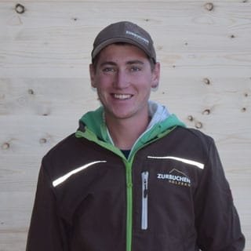 | `michael.jpg` | Team & Porträt | 11.2 KB | 320x320 | 28.09.2026 19:08 | 🟢 Im Einsatz in `zurbuchen_Holzbauer.html` |
| 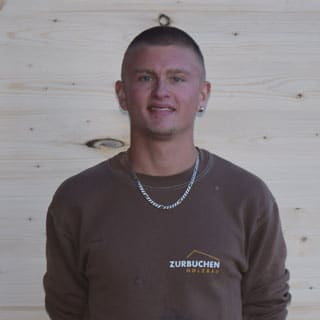 | `samuel.jpg` | Team & Porträt | 8.2 KB | 320x320 | 28.09.2026 19:08 | 🟢 Im Einsatz in `zurbuchen_Holzbauer.html` |
| 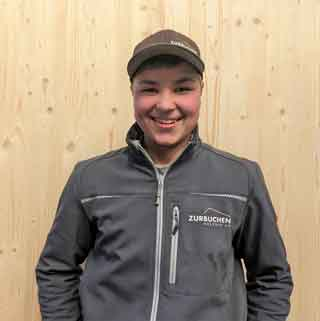 | `simon.jpg` | Team & Porträt | 6.8 KB | 320x321 | 28.09.2026 19:08 | 🟢 Im Einsatz in `zurbuchen_Holzbauer.html` |

---

## 2. Wie füge ich neue Bilder hinzu?
1. **Direkt ablegen:** Speichere dein neues Foto einfach im lokalen Ordner `Hiltbrand-Karriere\images\`.
2. **Automatische Synchronisation:** Syncthing überträgt das Bild in unter 2 Sekunden auf die Magnet-XS Cloud.
3. **Sofort verfügbar:** Das Bild taucht sofort im Cockpit unter `[ 🖼️ Bilder ]` auf und kann mit 1 Klick ausgetauscht werden!

